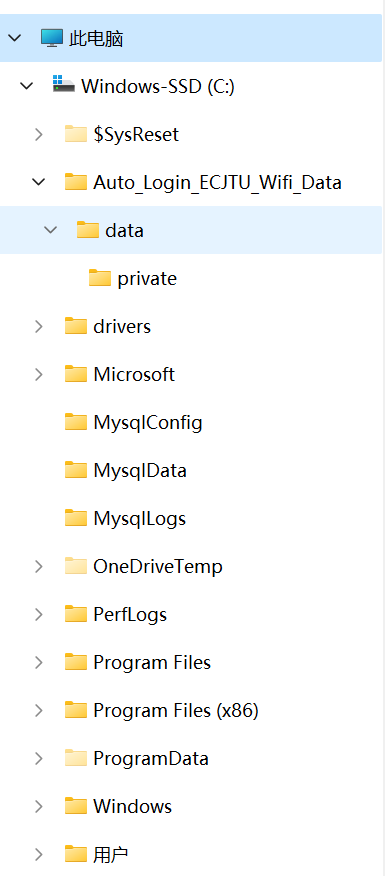

# 文件移动

## 单个文件移动

### 前端页面显示

- 选中文件，在下拉多选框中，选择移动
- 弹窗，利用树状结构显示所有文件夹，如下：

- 选中目标文件夹，点击确定

### 后端实现

- 接收文件id，并获取到移动的目标文件夹id
- 验证JWT，获取用户id
- 在用户对应的文件视图表中，查询文件id是否存在
- 如果存在，说明这个文件是用户的文件
- 再次查询目标文件夹id是否存在于，用户的文件夹视图表中
- 如果存在，说明这个文件夹也是用户的，获取目标文件夹的`文件夹的层级关系`
- 更新文件表中，文件id对应的文件夹的层级关系，更新为：`目标文件夹的层级关系+"-"+文件夹`
- 返回成功信息

## 多个文件移动

类似于单个文件移动，只是文件id是多个
