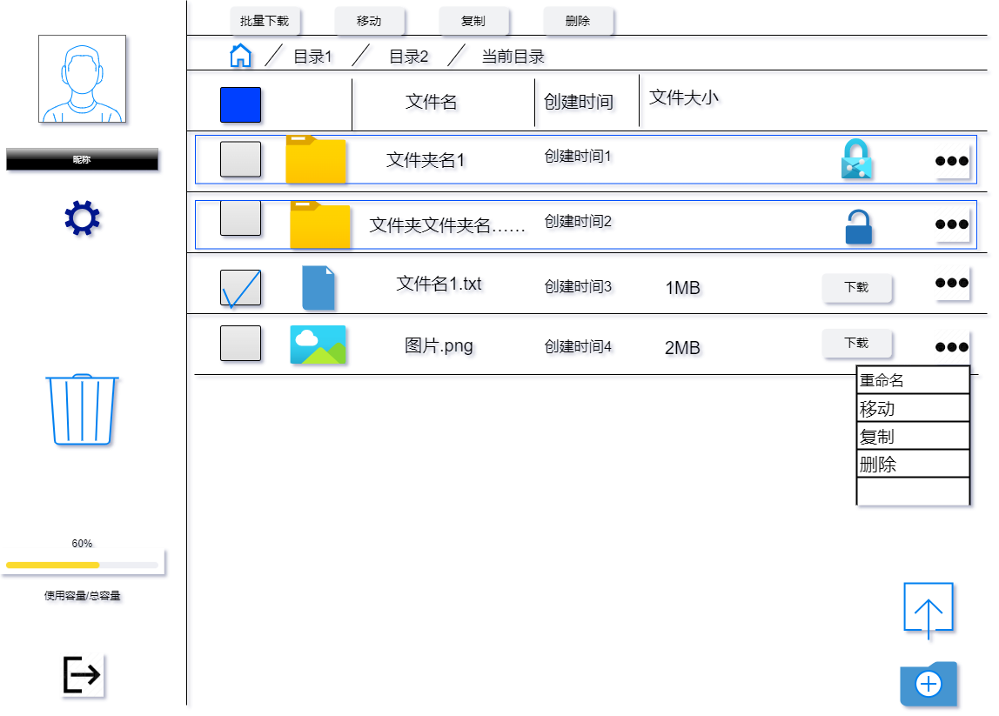

# 最重要的部分

## 1. 网页整体设计

需求分析写得比较详细，下面用一张图展示

## 2. 网页部分

### 2.1 网盘左侧，用户信息区域

#### 后端提供的数据，从数据库中获取：
- 头像地址
- 昵称
- 使用空间
- 总空间

#### 前端展示：
- 头像
- 昵称
- 使用空间
- 总空间
- 使用空间百分比
- 使用空间进度条
- 登出按钮
- 修改头像，昵称和密码按钮

### 2.2 网盘右侧，文件区域

#### 前端展示：
如果文件或文件夹的删除标志为true，不显示该文件或文件夹

- 批量操作按钮
    - 批量下载
    - 批量删除
    - 批量移动
    - 批量复制

- 父目录的路径
    - 点击路径中的文件夹，可以跳转到该文件夹

- 复选框
    - 选中文件夹或文件，可以进行批量操作

- 顶部详细信息页
    - 文件名(文件夹名)
    - 创建时间
    - 文件大小(文件夹不显示)

- 如果该目录存在文件夹
    - 复选框
    - 文件夹缩略图
    - 文件夹名
    - 文件夹创建时间
    - 文件夹是否被锁定
    - 更多下拉框

- 如果该目录存在文件
    - 复选框
    - 文件缩略图
    - 文件名
    - 文件创建时间
    - 文件大小
    - 下载按钮
    - 更多下拉框

#### 后端提供数据：

- 当前目录的路径，提供链接，点击跳转页面
    - 父类文件夹的URL
    - 文件夹名，按一定顺序排序

- 当前文件夹包含的文件
    - 文件id
    - 文件名
    - 文件大小
    - 缩略图路径
    - 文件创建时间

- 当前文件夹包含的文件夹
    - 文件夹id
    - 文件夹名
    - 文件夹创建时间
    - 文件夹是否被被锁定

### 2.3 页面一些操作

- 提示信息（错误或正确的信息）：底部提示信息5秒，然后消失（错误信息用红色字体，成功信息用绿色，其他用其他颜色）

- 点击文件夹，进入文件夹

- 点击顶部复选框，全选或全不选

- 点击文件夹或文件的复选框，选中或取消选中

- 点击文件夹或文件的更多下拉框，弹出下拉框

## 3. 网盘功能
具体功能的实现，参考下面的文档
### 悬浮按钮：
- [文件夹创建](文件夹创建.md)
- [文件上传](文件上传.md)

### 文件操作，包含批量和单独操作：

- [文件下载](文件下载.md)
- [文件重命名](文件重命名.md)
- [文件移动](文件移动.md)
- [文件复制](文件复制.md)
- [文件删除](文件删除.md)

### 文件夹操作，包含批量和单独操作：

有些操作类似文件操作，不再重复说明
- [文件夹复制](文件夹复制.md)
- [文件夹锁定与解锁](文件夹锁定与解锁.md)